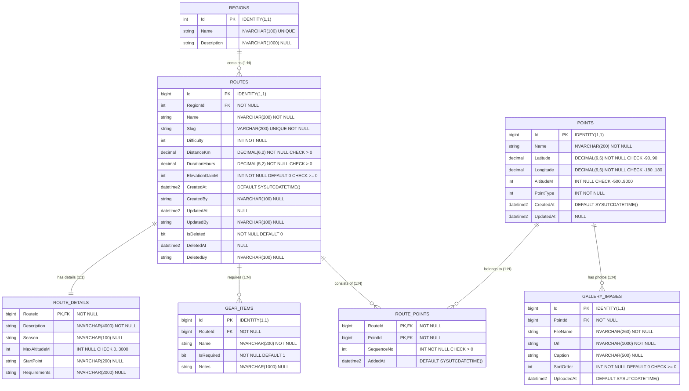

# Carpathians Catalog Service - ERD

```mermaid
erDiagram
    REGIONS ||--o{ ROUTES : "contains (1:N)"
    ROUTES ||--|| ROUTE_DETAILS : "has details (1:1)"
    ROUTES ||--o{ GEAR_ITEMS : "requires (1:N)"
    ROUTES ||--o{ ROUTE_POINTS : "consists of (1:N)"
    POINTS ||--o{ ROUTE_POINTS : "belongs to (1:N)"
    POINTS ||--o{ GALLERY_IMAGES : "has photos (1:N)"

    REGIONS {
        int Id PK "IDENTITY(1,1)"
        string Name "NVARCHAR(100) UNIQUE"
        string Description "NVARCHAR(1000) NULL"
    }

    ROUTES {
        bigint Id PK "IDENTITY(1,1)"
        int RegionId FK "NOT NULL"
        string Name "NVARCHAR(200) NOT NULL"
        string Slug "VARCHAR(200) UNIQUE NOT NULL"
        int Difficulty "INT NOT NULL"
        decimal DistanceKm "DECIMAL(6,2) NOT NULL CHECK > 0"
        decimal DurationHours "DECIMAL(5,2) NOT NULL CHECK > 0"
        int ElevationGainM "INT NOT NULL DEFAULT 0 CHECK >= 0"
        datetime2 CreatedAt "DEFAULT SYSUTCDATETIME()"
        string CreatedBy "NVARCHAR(100) NULL"
        datetime2 UpdatedAt "NULL"
        string UpdatedBy "NVARCHAR(100) NULL"
        bit IsDeleted "NOT NULL DEFAULT 0"
        datetime2 DeletedAt "NULL"
        string DeletedBy "NVARCHAR(100) NULL"
    }

    ROUTE_DETAILS {
        bigint RouteId PK,FK "NOT NULL"
        string Description "NVARCHAR(4000) NOT NULL"
        string Season "NVARCHAR(100) NULL"
        int MaxAltitudeM "INT NULL CHECK 0..3000"
        string StartPoint "NVARCHAR(200) NULL"
        string Requirements "NVARCHAR(2000) NULL"
    }

    GEAR_ITEMS {
        bigint Id PK "IDENTITY(1,1)"
        bigint RouteId FK "NOT NULL"
        string Name "NVARCHAR(200) NOT NULL"
        bit IsRequired "NOT NULL DEFAULT 1"
        string Notes "NVARCHAR(1000) NULL"
    }

    POINTS {
        bigint Id PK "IDENTITY(1,1)"
        string Name "NVARCHAR(200) NOT NULL"
        decimal Latitude "DECIMAL(9,6) NOT NULL CHECK -90..90"
        decimal Longitude "DECIMAL(9,6) NOT NULL CHECK -180..180"
        int AltitudeM "INT NULL CHECK -500..9000"
        int PointType "INT NOT NULL"
        datetime2 CreatedAt "DEFAULT SYSUTCDATETIME()"
        datetime2 UpdatedAt "NULL"
    }

    ROUTE_POINTS {
        bigint RouteId PK,FK "NOT NULL"
        bigint PointId PK,FK "NOT NULL"
        int SequenceNo "INT NOT NULL CHECK > 0"
        datetime2 AddedAt "DEFAULT SYSUTCDATETIME()"
    }

    GALLERY_IMAGES {
        bigint Id PK "IDENTITY(1,1)"
        bigint PointId FK "NOT NULL"
        string FileName "NVARCHAR(260) NOT NULL"
        string Url "NVARCHAR(1000) NOT NULL"
        string Caption "NVARCHAR(500) NULL"
        int SortOrder "INT NOT NULL DEFAULT 0 CHECK >= 0"
        datetime2 UploadedAt "DEFAULT SYSUTCDATETIME()"
    }
```
